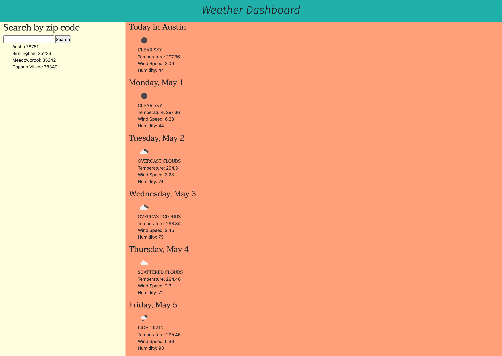

#### [Checkout the live deployment](https://willrcline.github.io/weather-dashboard/)

### Api Calls:
This application leverages [openWeathermap API](https://openweathermap.org/forecast5)
2 Api calls are made using js: one to get coordinates for that zip code and the other to get the weather data for those coords.

### Location search:
It displays the weather data for the chosen zip code for today and the following 5 days.
It saves the previous searches to localStorage and those are clickable to get the search for that location displayed again.

### Future: 
Add faded gif for background based on weather conditions (ie. rainy= rainy day gif)

